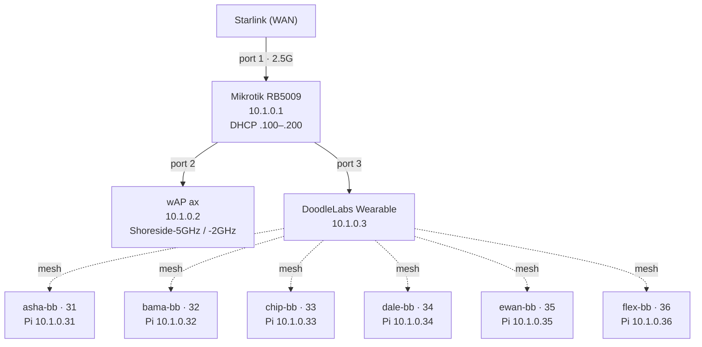
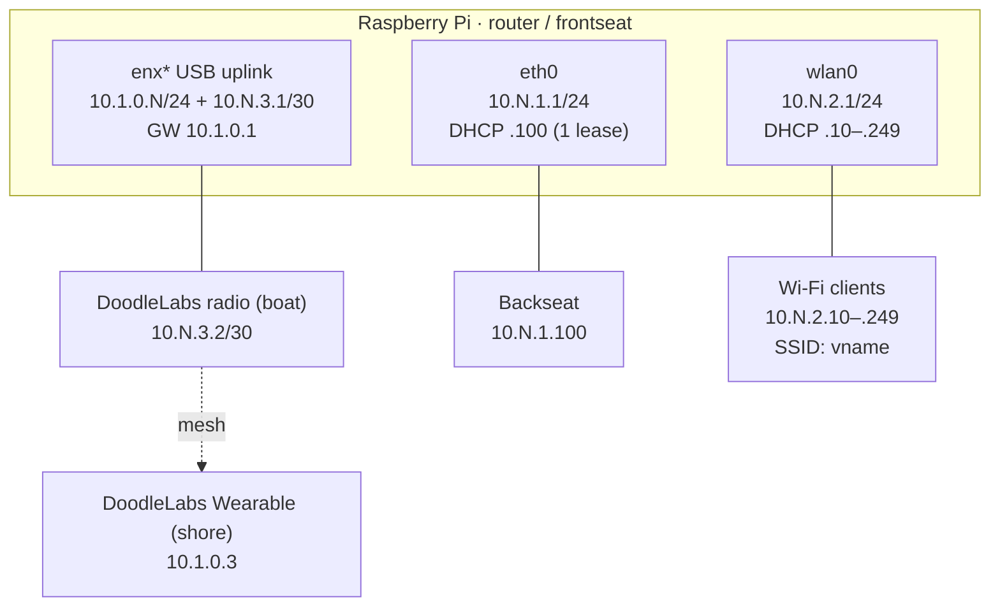

# Fleet and Network Reference

Authoritative reference for the Greece deployment: which boats exist, their
identifiers, IP assignments, and the shoreside infrastructure they connect
to. Every other doc in this folder assumes these values.

---

## 1. Overview

The Greece site runs one shore installation serving a fleet of up to six
BlueBoat USVs. Each boat carries a Raspberry Pi as its onboard computer,
acting as router, DHCP server, and firewall across three network domains: a
USB-Ethernet uplink to shore over a DoodleLabs radio, a wired `eth0` link to
the backseat payload computer, and an onboard `wlan0` Wi-Fi access point for
field devices.

On shore, a Mikrotik RB5009 is the central router and the fleet's default
gateway, with a wAP ax for field Wi-Fi, a DoodleLabs Wearable Mesh Rider as
the shore end of the boat radio link, and Starlink for internet uplink.

This document is the source of truth for boat identifiers, IP assignments,
and routes. It is reference-only — no setup procedures. For how the values
here are configured on a boat, see the build sequence
(`10_…`–`17_…`) and field operations (`30_…`).

## 2. Fleet Roster

| vname | BOAT_ID | Hull serial | Owner |
|---|---|---|---|
| asha-bb | 31 | TBD | TBD |
| bama-bb | 32 | TBD | TBD |
| chip-bb | 33 | TBD | TBD |
| dale-bb | 34 | TBD | TBD |
| ewan-bb | 35 | TBD | TBD |
| flex-bb | 36 | TBD | TBD |

BOAT_ID follows the lab scheme (31–36), so internal addressing matches the
lab counterparts; only the boat names and shore uplink IPs differ. IP
assignments derive from BOAT_ID per §4 and are materialized in §5.

> **Note.** Hull serials and per-boat owners are not yet recorded. Populate
> these columns as boats are assigned.

## 3. Shoreside Inventory

| Device | Model | Role | Mgmt IP | MAC | Location |
|---|---|---|---|---|---|
| Site router | Mikrotik RB5009 | Default gateway, DHCP server (pool 10.1.0.100–10.1.0.200) | 10.1.0.1 | TBD | TBD |
| Field Wi-Fi AP | MikroTik wAP ax | Laptop/tablet Wi-Fi — SSIDs `Shoreside-5GHz`, `Shoreside-2GHz` | 10.1.0.2 | TBD | TBD |
| Shore radio | DoodleLabs Wearable Mesh Rider | Shore end of the boat radio mesh | 10.1.0.3 | TBD | TBD |
| Internet uplink | Starlink | WAN to RB5009 port 1 | DHCP from Starlink | TBD | TBD |

**RB5009 port map:**

| Port | Speed | Connected device |
|---|---|---|
| 1 | 2.5G | Starlink uplink (WAN) |
| 2 | 1G | wAP ax |
| 3 | 1G | DoodleLabs Wearable (shore radio) |
| 4–8 | 1G | Spare |

> **Note.** MAC addresses and physical locations are not yet recorded.
> Populate as devices are installed.

## 4. Addressing Scheme

Addressing is deterministic from BOAT_ID. For a boat with **BOAT_ID = N**:

| Subnet | CIDR | Purpose | Pi address | Client addresses |
|---|---|---|---|---|
| Shore uplink | 10.1.0.0/24 | Greece site backbone | 10.1.0.**N** | — |
| Wired LAN | 10.**N**.1.0/24 | Backseat / wired payload | 10.**N**.1.1 | .100 (DHCP, 1 lease) |
| Wi-Fi AP | 10.**N**.2.0/24 | Wireless field devices | 10.**N**.2.1 | .10–.249 (DHCP, 240 leases) |
| Radio mgmt | 10.**N**.3.0/30 | Point-to-point to the boat's DoodleLabs radio | 10.**N**.3.1 | 10.**N**.3.2 (radio) |

The uplink NIC carries two addresses: the shore-facing **10.1.0.N/24** and a
secondary **10.N.3.1/30** alias for radio management.

**Worked examples**

- **asha (N = 31):** shore IP 10.1.0.31, eth0 subnet 10.31.1.0/24, wlan0
  subnet 10.31.2.0/24, radio mgmt 10.31.3.0/30.
- **dale (N = 34):** shore IP 10.1.0.34, eth0 subnet 10.34.1.0/24, wlan0
  subnet 10.34.2.0/24, radio mgmt 10.34.3.0/30.

## 5. Per-Boat IP Plan

| vname | BOAT_ID | Shore IP | eth0 GW (Pi) | Backseat IP | wlan0 GW (Pi) | Radio mgmt (Pi) | Radio mgmt (device) |
|---|---|---|---|---|---|---|---|
| asha-bb | 31 | 10.1.0.31 | 10.31.1.1 | 10.31.1.100 | 10.31.2.1 | 10.31.3.1 | 10.31.3.2 |
| bama-bb | 32 | 10.1.0.32 | 10.32.1.1 | 10.32.1.100 | 10.32.2.1 | 10.32.3.1 | 10.32.3.2 |
| chip-bb | 33 | 10.1.0.33 | 10.33.1.1 | 10.33.1.100 | 10.33.2.1 | 10.33.3.1 | 10.33.3.2 |
| dale-bb | 34 | 10.1.0.34 | 10.34.1.1 | 10.34.1.100 | 10.34.2.1 | 10.34.3.1 | 10.34.3.2 |
| ewan-bb | 35 | 10.1.0.35 | 10.35.1.1 | 10.35.1.100 | 10.35.2.1 | 10.35.3.1 | 10.35.3.2 |
| flex-bb | 36 | 10.1.0.36 | 10.36.1.1 | 10.36.1.100 | 10.36.2.1 | 10.36.3.1 | 10.36.3.2 |

The shore default gateway for every boat is the RB5009 at **10.1.0.1**.

## 6. RB5009 Static Routes

The RB5009 needs a static route to each boat's internal subnets so that any
shore client on 10.1.0.0/24 can reach backseats and Wi-Fi clients. Each boat
contributes two routes (eth0 and wlan0), via the boat's shore uplink IP.

| Route name | Destination | Gateway (Pi uplink IP) |
|---|---|---|
| bb-asha-eth | 10.31.1.0/24 | 10.1.0.31 |
| bb-asha-wlan | 10.31.2.0/24 | 10.1.0.31 |
| bb-bama-eth | 10.32.1.0/24 | 10.1.0.32 |
| bb-bama-wlan | 10.32.2.0/24 | 10.1.0.32 |
| bb-chip-eth | 10.33.1.0/24 | 10.1.0.33 |
| bb-chip-wlan | 10.33.2.0/24 | 10.1.0.33 |
| bb-dale-eth | 10.34.1.0/24 | 10.1.0.34 |
| bb-dale-wlan | 10.34.2.0/24 | 10.1.0.34 |
| bb-ewan-eth | 10.35.1.0/24 | 10.1.0.35 |
| bb-ewan-wlan | 10.35.2.0/24 | 10.1.0.35 |
| bb-flex-eth | 10.36.1.0/24 | 10.1.0.36 |
| bb-flex-wlan | 10.36.2.0/24 | 10.1.0.36 |

> **Note.** A per-boat summary route (10.**N**.0.0/16 via 10.1.0.N) is an
> acceptable substitute for the two /24 routes. Whatever the form, keep
> 10.1.0.0/24 as the connected shore interface — never steer it to a boat.

## 7. Network Topology

Shore infrastructure linked to the fleet over the DoodleLabs mesh:

## 8. Per-Boat Onboard Topology

Drilldown for a single boat (BOAT_ID = N). The Pi routes between three
domains; the uplink NIC carries both the shore IP and the radio-management
/30 alias.

**NAT and forwarding summary.** The Pi runs `net.ipv4.ip_forward=1` with
loose reverse-path filtering (`rp_filter=2`, needed because the uplink NIC
holds multiple subnets). The FORWARD chain (default DROP) allows
established/related traffic, bidirectional eth0 ↔ wlan0 cross-talk, and
eth0/wlan0 → uplink for both the radio-mgmt /30 and general shore/internet
access. POSTROUTING does two NATs: traffic to the radio-mgmt /30 is SNATed to
10.N.3.1 (so the radio sees a /30-local source), and all other egress from
10.N.0.0/16 is masqueraded behind the Pi's shore IP, 10.1.0.N.

## 9. Traffic Flows

Five representative flows for asha (BOAT_ID = 31):

1. **Field laptop → backseat.** Laptop (10.1.0.150, via wAP ax) sends to
   10.31.1.100; RB5009 matches the static route to 10.1.0.31, forwards over
   the Wearable → boat radio → Pi uplink; the Pi forwards uplink → eth0 to the
   backseat. Return is masqueraded back through the Pi's shore IP.
2. **Backseat → internet.** Backseat (10.31.1.100) → Pi (10.31.1.1); the Pi
   masquerades the source to 10.1.0.31 out the uplink → RB5009 → masqueraded
   again out the Starlink WAN.
3. **Backseat → radio management.** Backseat → onboard radio at 10.31.3.2; the
   Pi SNATs the source to 10.31.3.1 so the radio sees a /30-local peer, then
   forwards the reply back to the backseat.
4. **Wi-Fi client → backseat.** Wi-Fi client (10.31.2.15) → backseat
   10.31.1.100; the Pi's FORWARD chain permits wlan0 ↔ eth0, routing the
   packet between the two internal subnets.
5. **Boat-to-boat (asha → bama).** asha backseat → 10.32.1.100; because the
   destination is outside asha's radio-mgmt /30, egress is masqueraded to
   10.1.0.31. RB5009 matches the route to 10.1.0.32 and forwards back over the
   same mesh to bama's Pi, which delivers it out eth0.

> **Note.** Egress MASQUERADE means boat-to-boat connections appear to
> originate from the source boat's shore IP (10.1.0.N), not from the
> backseat's 10.N.1.100. When end-to-end addressing matters (e.g., inspecting
> a shared MOOSDB), connect from a shore laptop on 10.1.0.0/24 — those flows
> are not masqueraded.

## 10. Glossary of Identifiers

| Identifier | What it is | Where it's set | What consumes it |
|---|---|---|---|
| `BOAT_ID` | Integer 31–36; drives all internal addressing | `boat-network.conf` | Network setup scripts; derives every 10.N.x.x subnet |
| `BOAT_NAME` | Boat vname, e.g. `asha-bb` | `boat-network.conf` | hostapd SSID, logs, operator reference |
| `vname` | MOOS vehicle name (= `BOAT_NAME`) | MOOS mission files | MOOS community / shoreside display |
| `UPLINK_IP` | Pi's shore-facing IP, 10.1.0.N | `boat-network.conf` | Uplink `.network` config; RB5009 routes |
| `UPLINK_GW` | Shore default gateway, 10.1.0.1 (RB5009) | `boat-network.conf` | Uplink `.network` default route |
| `WIFI_COUNTRY` | Regulatory domain, `GR` for Greece | `boat-network.conf` | hostapd; sets the Wi-Fi regulatory domain |

## 11. Change Log

Append-only log of fleet-level changes (boat added/retired, shore device
replaced, IP plan revised). One line per change: date — change — author.

- 2026-06-02 — Initial reference migrated from `greece_specific_networking.md`. — JWenger
