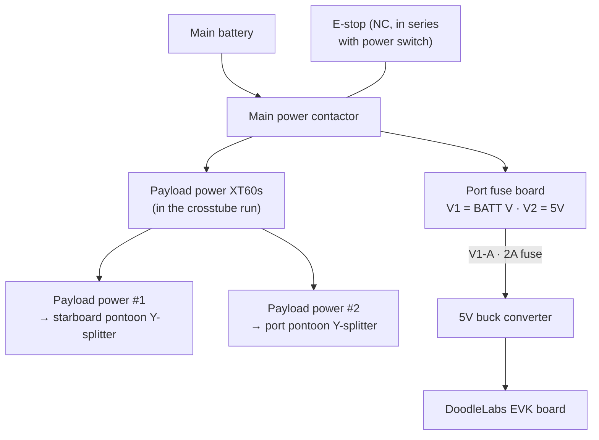
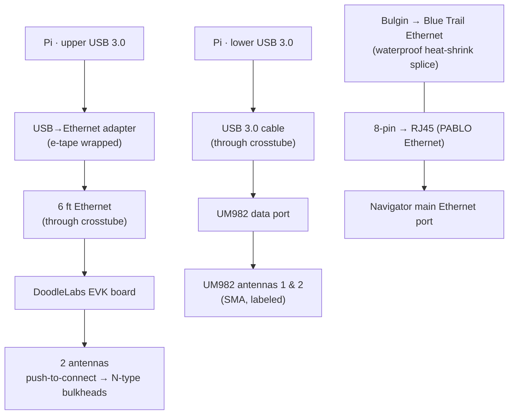

# Electrical Wiring

Power, signal, and data wiring for a mechanically assembled boat. Picks up
from `10_mechanical_assembly.md` and leaves the boat ready for first boot
(`13_frontseat_first_boot.md`).

---

## 1. Overview

This guide wires a mechanically assembled boat: the E-stop in the safety
loop, main power delivery, payload power to each pontoon, radio power, and all
data connections. It leaves the radio powered but not yet configured — radio
configuration is `12_doodle_labs_radio.md`. Verification criteria are in §9;
the formal sign-off checkboxes live in
[`20_qc_signoff.md`](20_qc_signoff.md).

## 2. Prerequisites

- Mechanical assembly complete (`10_mechanical_assembly.md`).
- Tools: soldering iron, heat-shrink gun, crimper, multimeter, connectivity
  tester.
- Parts: XT60 connectors, JST connectors, buck converters, fuses, e-tape,
  waterproof heat-shrink.

## 3. Context

### 3.1 Cable Management Principles

Keep cable management clean and add strain relief wherever possible; assume
these boats will not be handled gently. Mount the radio buck converter close
to the radio with short, twisted wires rather than long runs. Route inter-hull
cables (Ethernet, USB, payload power) through the crosstube. (Note: "crosstube"
is the inter-hull tube; "crossbar" is the frame member — see
[`10_mechanical_assembly.md` §4](10_mechanical_assembly.md#4-hull-and-default-configuration-blue-robotics-build-guide).)

Each hatch lid assembly carries a six-circuit fuse board split into two
sections: **V1** at battery voltage (BATT V — roughly 16.8 V full, ~12 V
depleted on a 4S pack) and **V2** at 5 V auxiliary. Each circuit is dead until
its MINI blade fuse is installed; fuse every circuit to the connected device's
draw. The DoodleLabs radio runs from **V1-A on the port fuse board** (see §7).
See the Blue Robotics
[BlueBoat General Integration Guide](https://bluerobotics.com/learn/blueboat-general-integration-guide/#electrical-and-data-interfacing)
and the
[full wiring diagram (PDF)](https://bluerobotics.com/wp-content/uploads/2025/06/BLUEBOAT-WIRING-DIAGRAM-6_30_2025.pdf)
for the stock power and data layout.

### 3.2 E-stop Safety Topology

The E-stop interrupts main power. The 3-pin signal cable runs through the
contact block on a normally-closed (NC) contact, and the 3-pin signal bulkhead
is spliced into the blue power wire so the switches sit in series. The result
is that the boat will not power on unless an E-stop is connected and released.

### 3.3 Power Tree

### 3.4 Data Path

## 4. Safety Wiring (E-stop)

1. Wire the 3-pin signal cable to the contact block; verify the specified
   pins are an NC contact.
2. Splice the 3-pin signal bulkhead into the blue power wire so the switches
   sit in series.
3. Confirm the boat will not power on without the E-stop connected
   (verification in §9.1).
4. Seal all solder joints with heat-shrink.

## 5. Main Power Path

1. Connect the blue switch connector (2-pin JST) to the main power contactor;
   verify it is securely seated.
2. Inspect and seal all power-path solder joints with heat-shrink.

## 6. Payload Power Delivery

The payload power connections sit on the XT60 connectors in the crosstube run.

1. Terminate payload power #1 (3-pin power) as an XT60 using the black and red
   wires.
2. Terminate payload power #2 (3-pin power) as an XT60 using the black and red
   wires.
3. Install the XT60 Y-splitter for the starboard pontoon, connected to payload
   power #1.
4. Install the XT60 Y-splitter for the port pontoon, connected to payload
   power #2.

## 7. Radio Power

The DoodleLabs radio is powered from **V1-A on the port fuse board** (battery
voltage), through a 2 A fuse and a 5 V buck converter.

1. Wire the input side of the 5 V buck converter to V1-A on the port fuse
   board, with a 2 A MINI blade fuse in that circuit.
2. Wire the 5 V output of the buck converter into the DoodleLabs EVK board.
3. Mount the buck converter close to the radio with short, twisted wires.

> **Critical.** The EVK board takes 5 V only and has no reverse-polarity
> protection. Confirm voltage and polarity before connecting — see
> [`12_doodle_labs_radio.md`](12_doodle_labs_radio.md).

## 8. Data Wiring

1. Run the 6 ft Ethernet cable through the crosstube and terminate it into the
   DL EVK board.
2. Connect both antennas to the DL push-to-connect ports with strain relief.
3. Connect both antennas to the N-type bulkhead connectors. Verify both
   antennas are fully seated **before powering on**.
4. Connect the USB→Ethernet adapter to the 6 ft Ethernet cable, wrap it in
   e-tape, and plug it into the Pi's upper USB 3.0 port.
5. Run the USB 3.0 cable through the crosstube and connect the UM982 data port
   to the Pi's lower USB 3.0 port.
6. Confirm UM982 antennas 1 and 2 are labeled, then connect them to the
   appropriate SMA ports.
7. Terminate the 8-pin Ethernet port as RJ45, run a connectivity test, and
   connect it to the Navigator's main Ethernet port.
8. Splice the Bulgin → Blue Trail Ethernet cable with waterproof heat-shrink
   and run a connectivity test.

## 9. Verification

### 9.1 E-stop Interlock

- With the E-stop disconnected, attempt to power on — the boat should not
  power.
- With the E-stop connected and engaged, the boat should not power.
- With the E-stop connected and released, the boat should power normally.

### 9.2 Power Rail Voltages

Measure at the buck converter output, at each pontoon's XT60 splitter, and at
the radio EVK input. Expected values and tolerances are collected in §10.

### 9.3 Data Connectivity

Run the cable-level connectivity tests for each Ethernet run (PABLO RJ45,
Bulgin splice) before applying boat power.

## 10. Troubleshooting

| Symptom | Likely cause | Fix |
|---|---|---|
| Boat won't power on with E-stop OK | Contactor JST not fully seated | Reseat the 2-pin JST on the main contactor. |
| Radio won't boot | Buck converter polarity or fuse | Check 5 V polarity into the EVK and the 2 A fuse. |
| Intermittent backseat link | Bulgin splice | Re-inspect the Bulgin → Blue Trail splice and re-run the connectivity test. |

## 11. Needs from Builder

Open items that only the person building the boat can supply:

- [ ] Expected power-rail voltages and tolerances for §9.2.
- [ ] Wire gauge (AWG) used on the main power and payload runs.
- [ ] Part numbers / sources for buck converters, fuses, and connectors.
- [ ] As-built photos: E-stop splice, contactor connection, pontoon
      splitters, radio power, data runs through the crosstube.

## 12. Change Log

Append-only log of changes to this procedure. One line per change: date —
change — author.

- 2026-06-02 — Initial draft; electrical steps and diagrams built from
  `QC_Build_Checklist.md`. Power-path detail from the BlueBoat Integration
  Guide: radio on port fuse board V1-A (2 A fuse → 5 V buck), payload power on
  the XT60s in the crosstube run; fuse-board (V1/V2) context and reference links
  added; open items collected in §11. — JWenger

